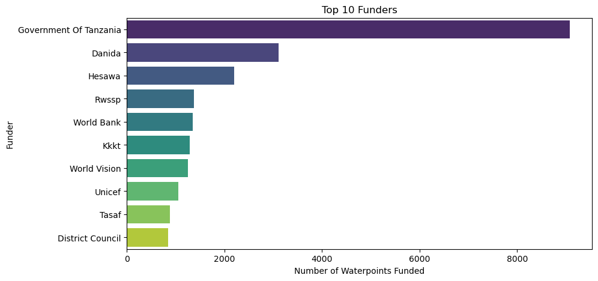
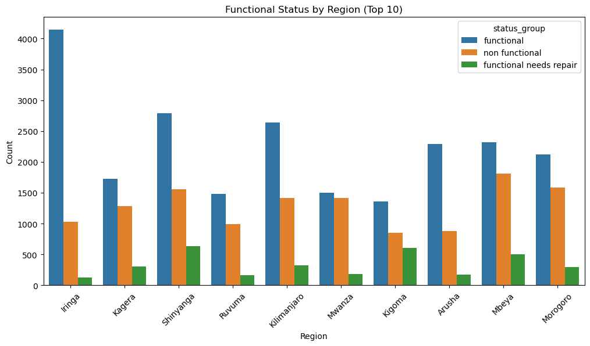
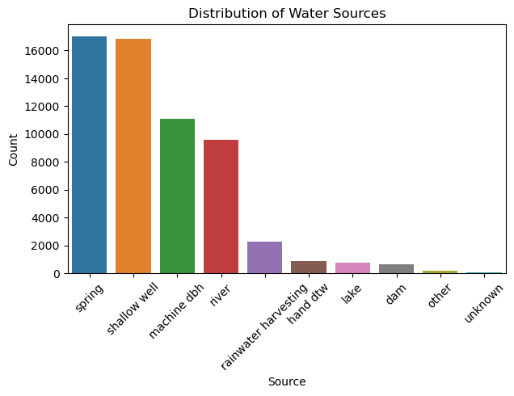

# **PHASE 3 PROJECT ON Tanzania WATER WELLS**
# Predicting Water Pump Functionality in Tanzania Using Machine Learning
# Porject Overview

The goal of this project is to:

1. Develop and evaluate machine learning models capable of predicting the operational status of Tanzanian water wells.

2. Apply an iterative modeling approach, starting from a simple baseline (Logistic Regression) and progressing to a more advanced ensemble model (Random Forest Classifier).

3. Compare model performance and interpret key predictors influencing pump functionality.

Ultimately, the project demonstrates how data-driven solutions can optimize decision-making in the water infrastructure sector.

# Business and Data Understanding
# Dataset Description

The dataset comes from the DrivenData “Pump It Up: Data Mining the Water Table” competition
It contains information for over 59,000 water points across Tanzania, with more than 40 features describing geographic, operational, and administrative details.

Target Variable: **status_group**

1. functional

2. non-functional

3. functional needs repair

# Key Features

**amount_tsh** – Total static head (water availability)

**gps_height** – Altitude of the well

**installer** – Who installed the pump

**basin, region, lga** – Location and administrative zones

**extraction_type, management, payment** – Operational and management details

**construction_year** – Installation year of the well

# Business Relevance

The project supports the sustainable management of Tanzania’s water resources by helping identify:

Wells that are likely to fail or need maintenance

High-risk regions where interventions should be prioritized

Factors that most influence well reliability

# Stakeholders

The key stakeholders in this project include:

**Government of Tanzania – Ministry of Water**: Uses insights to guide infrastructure investments and maintenance planning.

**Non-Governmental Organizations (NGOs)**: Partners such as World Bank, WaterAid, and UNICEF who support rural water access projects.

**Local Communities**: Residents relying on boreholes and wells for daily water needs.

**Project Engineers and Data Analysts**: Responsible for maintaining well functionality and using data-driven tools for monitoring.

**Policy Makers**: Use project findings to prioritize regions for intervention and optimize resource allocation.

# Data Loading and Cleaning

Imported data using pandas and inspected its structure and null values.

Below is the data visualization before cleaning

# Key Insights

**Water Sources Distribution:**
The majority of waterpoints are sourced from springs and shallow wells, followed by machine-drilled boreholes and rivers. Less common sources include rainwater harvesting, hand-dug wells, lakes, dams, and others.

**Functional Status by Region:**
Most waterpoints across regions are functional, though a significant portion are non-functional, and a smaller fraction require repair. This imbalance highlights operational and maintenance challenges, and it’s an important consideration for model training since the target variable is unevenly distributed.

**Funder Distribution:**
The Government of Tanzania is the top funder of water projects, followed by entries labeled as “unknown” (which may need further investigation), Danida, Hesawa, Rwssp, World Bank, Kkkt, World Vision, Unicef, and Tasaf.

**The Following steps were taken to clean the data**

1. Handling of missing Values
2. Conversion of data types & handling inconsistencies.
3. Dropping Reedundant/Low-value Features

   After cleaning following steps were performed to finalize data preparation
1.  Scaling numeric features
2. Encoding categorical variables
3. Encoding the target (status_group)
4. Splitting Data for Modeling

# Modeling

# Baseline Logistic Regression 
a Baselinge ligistic regression model was created and bellow were the model performance

Baseline Logistic Regression Results
Training Accuracy: 0.624125
Testing Accuracy: 0.6375

Classification Report:
              precision    recall  f1-score   support

           0       0.63      0.77      0.69      1007
           1       0.00      0.00      0.00       134
           2       0.65      0.58      0.61       859

    accuracy                           0.64      2000
   macro avg       0.43      0.45      0.44      2000
weighted avg       0.60      0.64      0.61      2000

The baseline logistic regression model achieved a training accuracy of **62.1%** and a testing accuracy of **63.75%**, indicating moderate but limited predictive performance.

**Observations:**

The model performs reasonably well on the majority classes (0 and 2), with F1-scores around 0.62–0.63.

However, it completely fails to predict class 1 (F1-score = 0), suggesting class imbalance — this class likely has very few samples compared to others.

The small gap between training and testing accuracy indicates no significant overfitting, but overall performance is low.

**Insights:**

The low recall and precision for the minority class highlight the need for data balancing techniques (e.g., SMOTE, class weights) or more advanced models (e.g., Random Forest, XGBoost).

This baseline provides a useful benchmark for comparing improved models after feature engineering or resampling.

 

