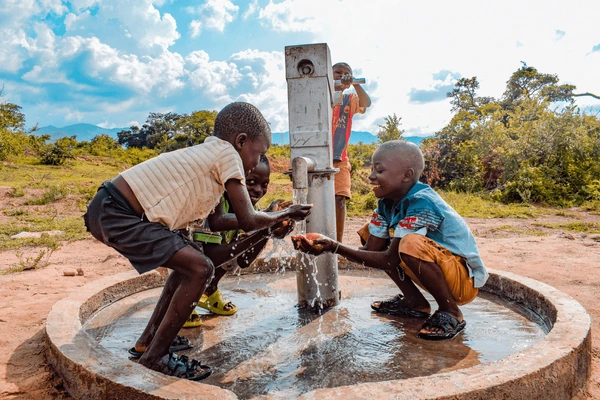
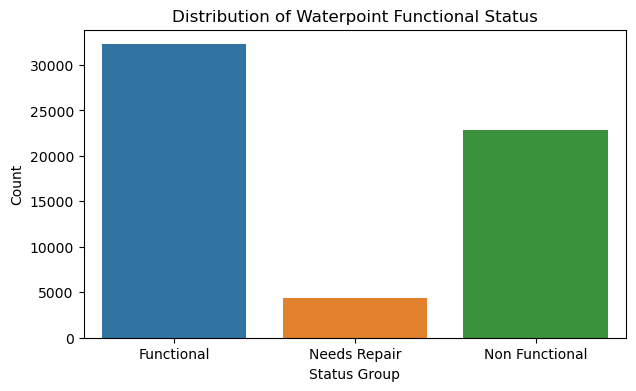

# **PHASE 3 PROJECT ON Tanzania WATER WELLS**
# Predicting Water Pump Functionality in Tanzania Using Machine Learning
# Porject Overview

The goal of this project is to:

1. Develop and evaluate machine learning models capable of predicting the operational status of Tanzanian water wells.

2. Apply an iterative modeling approach, starting from a simple baseline (Logistic Regression) and progressing to a more advanced ensemble model (Random Forest Classifier).

3. Compare model performance and interpret key predictors influencing pump functionality.

Ultimately, the project demonstrates how data-driven solutions can optimize decision-making in the water infrastructure sector.

# Business and Data Understanding
# Dataset Description

The dataset comes from the DrivenData “Pump It Up: Data Mining the Water Table” competition
It contains information for over 59,000 water points across Tanzania, with more than 40 features describing geographic, operational, and administrative details.

Target Variable: **status_group**

1. functional

2. non-functional

3. functional needs repair

# Key Features

**amount_tsh** – Total static head (water availability)

**gps_height** – Altitude of the well

**installer** – Who installed the pump

**basin, region, lga** – Location and administrative zones

**extraction_type, management, payment** – Operational and management details

**construction_year** – Installation year of the well

# Business Relevance

The project supports the sustainable management of Tanzania’s water resources by helping identify:

Wells that are likely to fail or need maintenance

High-risk regions where interventions should be prioritized

Factors that most influence well reliability

# Stakeholders

The key stakeholders in this project include:

**Government of Tanzania – Ministry of Water**: Uses insights to guide infrastructure investments and maintenance planning.

**Non-Governmental Organizations (NGOs)**: Partners such as World Bank, WaterAid, and UNICEF who support rural water access projects.

**Local Communities**: Residents relying on boreholes and wells for daily water needs.

**Project Engineers and Data Analysts**: Responsible for maintaining well functionality and using data-driven tools for monitoring.

**Policy Makers**: Use project findings to prioritize regions for intervention and optimize resource allocation.

# Data Loading and Cleaning

Imported data using pandas and inspected its structure and null values.

Below is the data visualization before cleaning

Dropped irrelevant or redundant features (recorded_by, wpt_name).

Addressed missing values using appropriate imputation strategies.

Standardized column types and encoded categorical features for modeling.

Confirmed data consistency and absence of duplicates.

7. 

